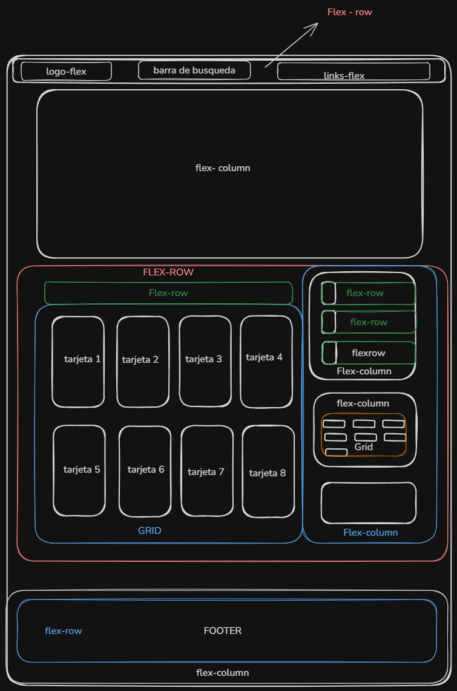

# Lumina


## Descripción

**Lumina** es una página web dedicada al descubrimiento y lectura de manhuas. Permite explorar diferentes historias, consultar los últimos capítulos, descubrir contenido según su género y encontrar los manhuas más populares de la semana.


## Características

*  Búsqueda de manhuas por título o género.
*  Sección de nuevos capítulos.
*  Ranking de manhuas más populares.
*  Exploración de diferentes géneros.
*  Sección para continuar leyendo.
*  Perfil de usuario.
*  Información sobre los manhuas.
*  Interfaz sencilla y organizada.

## Tecnologías utilizadas

* **HTML5** — estructura y contenido de la página.
* **CSS3** — diseño, estilos y animaciones.

## Estructura del proyecto

```text
Lumina/
│
├── assets/
│   ├── logo.png
│   ├── user-icon.png
│   ├── chapter-icon.png
│   ├── tendencia.png
│   ├── play.png
│   └── manhuas/
│
├── css/
│   └── styles.css
│
├── index.html
│
└── README.md
```

## Instalación y ejecución

1. Descarga o clona el repositorio.
2. Abre la carpeta del proyecto.
3. Abre el archivo `index.html` en tu navegador.

También puedes utilizar **Live Server** desde Visual Studio Code para ejecutar el proyecto durante el desarrollo.


## ¿En qué parte se utilizó Flexbox, Grid y por qué?



Durante el desarrollo de **Lumina**, el uso de **CSS Grid y Flexbox** permitió organizar la página de acuerdo con las necesidades de cada sección.

**Flexbox** se utilizó principalmente para organizar elementos en una dirección, ya fuera horizontal o vertical. Por ejemplo, se utilizó en la barra de navegación para colocar el logo, el buscador y los enlaces; en la sección principal para colocar los capítulos junto al panel de métricas; en las tarjetas del Top semanal para organizar el número, la portada y la información; y en el footer para distribuir sus diferentes secciones.

Una de las ventajas de Flexbox en el proyecto fue que permitió controlar fácilmente la **alineación, separación y dirección** de los elementos mediante propiedades como `align-items`, `justify-content`, `flex-direction` y `gap`.

Por otro lado, **CSS Grid** se utilizó en las partes donde el contenido necesitaba una estructura más parecida a una cuadrícula. Esto se puede observar principalmente en las tarjetas de **Nuevos capítulos**, donde se establecieron cuatro columnas para organizar las ocho tarjetas, y en **Explorar géneros**, donde se establecieron tres columnas para distribuir los diferentes géneros.

La principal diferencia que se pudo observar durante el desarrollo es que **Flexbox resulta más conveniente para organizar elementos en una sola dirección**, mientras que **Grid resulta más conveniente cuando se necesita controlar filas y columnas al mismo tiempo**.


## Autor

Natalia Orozco Ropero


## Licencia

Este proyecto fue creado con fines educativos y de aprendizaje.


